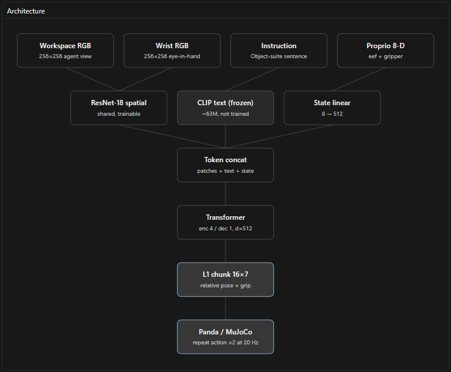

# LC-ACT


---

**Status:** approved. Canonical card for the code in this folder. If implementation drifts, update this file in the same change.

Language-conditioned action chunking transformer. Small imitation policy for LIBERO-Object (Franka in MuJoCo). Not a 7B VLA. Not the x500.

| | |
| --- | --- |
| Name | LC-ACT |
| Package | `lc_act` |
| Primary eval | “pick up the alphabet soup and place it in the basket” |
| Done bar | ≥2 / 10 soup episodes + a rollout video |
| Recipe | ACT (Zhao et al., 2023) + OFT L1/chunks (Kim et al., 2025) + LIBERO ResNet-T language (Liu et al., 2023) |

## Why this shape

Collapsing each camera to one CLIP vector throws away grasp geometry. ACT and LIBERO’s ResNet-T keep a **spatial feature map**. OpenVLA-OFT on LIBERO:

- Parallel decode + **action chunking**: +14 average success vs autoregressive OpenVLA (76.5% → 90.2%).
- **Continuous L1** vs discrete tokens: +5 (→ 95.3%). L1 matched diffusion; diffusion was slower.
- Wrist + proprio + language: **98.4% LIBERO-Object** on a 7B model (not ours).

Scratch Diffusion Policy already hits **92.5% Object**. We need spatial chunks + L1, not a giant VLM.

Rejected on this 8 GB laptop: OpenVLA-OFT 7B (25–62 GB), SmolVLA (10–16 GB), MiniVLA/TinyVLA VLMs, CLIP-CLS TinyVLA, CVAE, flow matching.

## Architecture



The PNG is a schematic. Token tagging below matches the code.

```
workspace RGB 256×256 ──┐
                        ├── shared ResNet-18 (trainable, no global pool)
wrist RGB 256×256 ──────┘         │
                                  ▼
                         8×8 spatial tokens per camera
                         + 2-D sinusoidal pos embed (ACT)
                         + learned camera id (workspace vs wrist)
instruction ── frozen CLIP text ──► 1 language token + type tag
proprio 8-D ── linear ────────────► 1 state token + type tag

concat → transformer encoder (d=512, 8 heads, 4 layers, FFN 2048)
      → 16 action queries, 1-layer decoder (cross-attend)
      → linear → (16, 7) relative pose + gripper
      → L1 vs z-scored demo chunk
```

Without the 2-D sine and camera tags, the encoder is permutation-invariant and cannot use patch location or which camera a token came from.

**Inference:** predict 16 steps at 10 Hz, execute open-loop, replan. MuJoCo LIBERO is 20 Hz → repeat each action twice.

| Piece | Params | Train? |
| --- | --- | --- |
| ResNet-18 shared | 11.19M measured (v0) | yes |
| Transformer + head | 17.36M measured (v0) | yes |
| Camera + type tags | 2,048 (2×512 + 2×512) | yes |
| CLIP text | ~63M | frozen |
| Trainable total | 28,541,409 (v0, no tags); +2,048 after tags | |
| VRAM result | Batch 8 fit on RTX 4060 Laptop 8 GB (v0) | |

v0 weights: `outputs/lc_act/last_nopos_3epoch.pt` (2026-09-14, 3 epochs, 0/10 soup). They will not load into this architecture. Overnight training writes a new `last.pt`.

## Data and eval

- Dataset: [`lerobot/libero`](https://huggingface.co/datasets/lerobot/libero) (~1.9 GB). LeRobot `video_backend="pyav"`; the installable package is `av`. Keep `pick up the .+ and place it in the basket`.
- Normalize state/action with subset mean/std; store stats in the checkpoint.
- Eval images: flip H and W (dataset is 180° from raw MuJoCo).
- Env: single gym `LiberoEnv`, `libero_object` task 0, relative 7-D, 280 steps.

## Intended use / not

Learn image + language → action chunk → env. Same slot as Starscream `HoverPolicy`, different body.

Not for drone flight, OpenVLA-level generalization, or beating 98% Object.

## Risks

- Ten short instructions: language can be ignored. Cream-cheese eval is the check.
- If the arm overshoots, drop H to 8 before adding diffusion.
- WSL 10 GB RAM: `num_workers=0`.

## Cite

- Zhao et al., ACT, 2023.
- Kim et al., OpenVLA-OFT, 2025.
- Liu et al., LIBERO, 2023.
- Wen et al., TinyVLA, RA-L 2025 — different model; name collision only.

## How to determine completion / termination criteria in realtime

Not in the current design, but common extensions:

- Option A: 8th action dim = terminate probability
- Option B: separate head: model(obs) → (16,7) + done_logit
- Option C: heuristic on chunk - if all 16 actions ≈ zero, treat as "hold/stop"

None of these exist in LC-ACT now. Training also doesn't label “done” - demos just end when the expert finishes, and late frames get padded with the last action, not a stop signal.