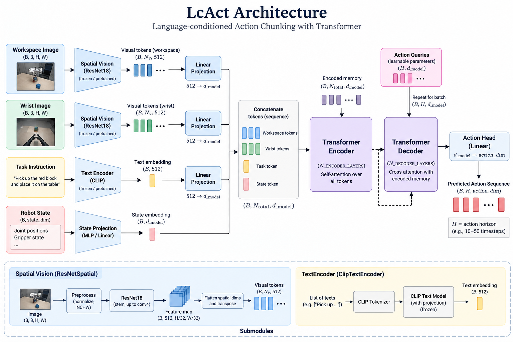

# LC-ACT

LC-ACT is a tabletop Franka Panda arm policy in MuJoCo LIBERO. This repository
is a **VLA research lab** for future Starscream policies: same observe → chunk
→ act slot as the drone's `HoverPolicy`, different body. It is not the x500
and not the Starscream flight stack.

GitHub: [gouthamk16/lc-act](https://github.com/gouthamk16/lc-act). In
Starscream this repo is the `vla/` git submodule.



## The observe-to-act loop

The model has the same three boxes as any small vision-language-action (VLA)
policy:

1. **Vision**: a shared trainable ResNet-18 turns workspace and wrist images
   into spatial tokens. Each token gets an ACT-style 2-D sinusoidal position
   embedding plus a learned camera id (workspace vs wrist).
2. **Language**: frozen CLIP text turns the instruction into a language token
   (plus a learned type tag).
3. **Action**: a transformer combines those tokens with the 8-D robot state
   (plus a type tag) and predicts a 16-step chunk of relative 7-D pose/gripper
   actions.

The closed loop is **observe → predict a chunk → execute at 20 Hz → observe
again**. The policy predicts at 10 Hz, so each action is repeated twice before
replanning. Training uses all ten LIBERO-Object pick-and-place tasks and the
first evaluation is the alphabet-soup task.

More about the model architecture in [MODEL.md](MODEL.md).

## Install

CUDA wheels first, then the rest. From **this repository root** (standalone
clone of `lc-act`, or `cd vla` inside Starscream):

```bash
python3 -m venv .venv
source .venv/bin/activate
pip install torch torchvision --index-url https://download.pytorch.org/whl/cu128
pip install -r requirements.txt
pip install -e .
```

`av` in `requirements.txt` is the PyAV video backend used by LeRobot.

Starscream checkout:

```bash
git clone --recurse-submodules https://github.com/gouthamk16/starscream.git
cd starscream/vla
```

If you already cloned Starscream without submodules:

```bash
git submodule update --init vla
```

## Run

MuJoCo needs EGL in the WSL GPU environment:

```bash
export MUJOCO_GL=egl
```

Overnight train (no wall-clock cap; writes `outputs/lc_act/last.pt` every 100
steps, every epoch, and on Ctrl+C):

```bash
python -m lc_act.train --out outputs/lc_act --epochs 20 --batch-size 8 --max-hours 0
```

Resume after a stop or crash:

```bash
python -m lc_act.train --resume outputs/lc_act/last.pt --out outputs/lc_act --epochs 20 --max-hours 0
```

`--max-hours 2` is still the default if you omit the flag. `--max-hours 0`
means no deadline. The command downloads `lerobot/libero`, fits normalization
statistics without decoding RGB for that pass, and uses `num_workers=0` for
the 10 GB WSL memory ceiling. If CUDA reports out of memory, rerun with
`--batch-size 4`.

Evaluate ten fixed-seed soup episodes and save episode zero:

```bash
python -m lc_act.eval \
  --ckpt outputs/lc_act/last.pt \
  --episodes 10 \
  --seed 0 \
  --video outputs/lc_act/soup_ep0.mp4
```

The success criterion is **at least 2/10** successful soup episodes and an
existing playable `outputs/lc_act/soup_ep0.mp4`.

## Mapping to Starscream

The tabletop mapping is the same policy slot used later by the drone:

```text
LcAct → pose deltas → Panda
HoverPolicy → TrajectorySetpoint → PX4
```

The body and simulator differ; this README does not add a drone or PX4
integration.

## Results

Measured 2026-09-14 on an RTX 4060 Laptop (8 GB), **before** spatial/camera
tags:

- Training used batch 8 with both cameras and fit the GPU. The two-hour CLI
  cap stopped the run after epochs 0–2.
- Epoch logs: `epoch=0 l1=0.3980 samples/s=26.7`,
  `epoch=1 l1=0.3325 samples/s=47.1`, and
  `epoch=2 l1=0.2899 samples/s=19.1`.
- Evaluation result: `successes=0/10`.
- Video: `outputs/lc_act/soup_ep0.mp4` exists, is readable H.264, 256×256,
  20 FPS, and about 49.6 seconds long.
- Weights kept as `outputs/lc_act/last_nopos_3epoch.pt` (28,541,409 trainable
  parameters). They do not load into the tagged architecture.

The 0/10 result does not meet the 2/10 bar. The next run is overnight training
with position and camera tags; that checkpoint will be a new `last.pt`.
