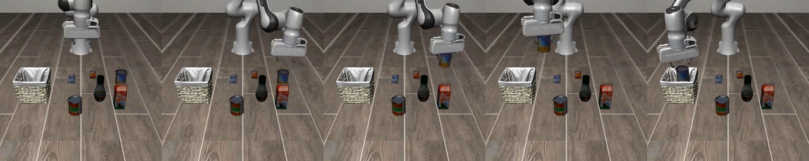

# LC-ACT

LC-ACT is a tabletop Franka Panda arm policy in MuJoCo LIBERO. This repository
is a **VLA research lab** for future [Starscream](https://github.com/gouthamk16/starscream) policies: same observe → chunk
→ act slot as the drone's `HoverPolicy`, different body. It is not the x500
and not the [Starscream](https://github.com/gouthamk16/starscream) flight stack.

GitHub: [gouthamk16/lc-act](https://github.com/gouthamk16/lc-act). In
[Starscream](https://github.com/gouthamk16/starscream) this repo is the `vla/` git submodule.

https://github.com/user-attachments/assets/9feb41c1-1167-4c94-8cdf-37dc87565e42

*A closed-loop demo of the trained policy.*



*Closed-loop LIBERO-Object rollout: reach, grasp, carry, and release into the
basket (frames left to right).*

## The observe-to-act loop

The model has the same three boxes as any small vision-language-action (VLA)
policy:

1. **Vision**: workspace and wrist images are resized to 128×128 and encoded by
   a shared, trainable ResNet-18 cut after layer3 into an 8×8 grid of tokens
   per camera. Each token gets an ACT-style 2-D sinusoidal position embedding,
   a learned camera id (workspace vs wrist), and FiLM modulation from the
   instruction.
2. **Language**: frozen CLIP text turns the instruction into one language
   token (plus a learned type tag). Embeddings are cached per instruction
   string.
3. **Action**: a small transformer (width 256, 3 encoder and 2 decoder layers)
   combines those tokens with the 8-D robot state (plus a type tag) and
   predicts a 16-step chunk of relative 7-D pose/gripper actions.

The closed loop is **observe → predict a 16-step chunk → execute one action →
observe again**. The policy replans every env step and executes the ACT
temporal ensemble of every chunk that covers that step. One dataset row is one
env control step; the dataset's 10 fps is a metadata label only.

By default training uses the ten LIBERO-Object pick-and-place tasks.
`--all-tasks` trains on all 40 LIBERO tasks, and `--n-obs 2` adds the previous
frame and state to each observation. Evaluation is on LIBERO-Object.

The trainable model is 7.6M parameters. Inference takes 7.1 ms per chunk and
0.30 GB VRAM on an RTX 4060 Laptop, most of it the frozen CLIP text encoder.

More about the model architecture in [MODEL.md](MODEL.md).

## Install

CUDA wheels first, then the rest. From **this repository root** (standalone
clone of `lc-act`, or `cd vla` inside [Starscream](https://github.com/gouthamk16/starscream)):

```bash
python3 -m venv .venv
source .venv/bin/activate
pip install torch torchvision --index-url https://download.pytorch.org/whl/cu128
pip install -r requirements.txt
pip install -e .
```

`av` in `requirements.txt` is the PyAV video backend used by LeRobot.

[Starscream](https://github.com/gouthamk16/starscream) checkout:

```bash
git clone --recurse-submodules https://github.com/gouthamk16/starscream.git
cd starscream/vla
```

If you already cloned [Starscream](https://github.com/gouthamk16/starscream) without submodules:

```bash
git submodule update --init vla
```

## Run

MuJoCo needs EGL in the WSL GPU environment:

```bash
export MUJOCO_GL=egl
```

Long train. The current weights came from this 3-hour run; the cosine learning
rate schedule spans the `--max-hours` deadline, or `--epochs` when there is
none:

```bash
python -m lc_act.train --out outputs/lc_act --max-hours 3 --epochs 999 --save-every 2000
```

All 40 LIBERO tasks with two-frame history (not yet evaluated; the all-task
startup pass over 273k rows takes a few minutes before training begins):

```bash
python -u -m lc_act.train --all-tasks --n-obs 2 --max-hours 6 --epochs 999 \
  --save-every 2000 --out outputs/lc_act_all40_hist
```

Resume after a stop or crash (pass the same `--n-obs` the checkpoint was
trained with):

```bash
python -m lc_act.train --resume outputs/lc_act/last.pt --out outputs/lc_act --epochs 20 --max-hours 0
```

`--max-hours 2` is still the default if you omit the flag. `--max-hours 0`
means no deadline. The command downloads `lerobot/libero`, fits normalization
statistics without decoding RGB for that pass, and decodes video with 6 loader
workers (batch 16), which leaves ~3.5 GB free under the 10 GB WSL ceiling. If
RAM runs out, lower `--workers`.

Evaluate ten fixed-seed soup episodes and save episode zero:

```bash
python -m lc_act.eval \
  --ckpt outputs/lc_act/last.pt \
  --episodes 10 \
  --seed 0 \
  --video outputs/lc_act/soup_ep0.mp4
```

The original done bar was at least 2/10 successful soup episodes plus a
playable `outputs/lc_act/soup_ep0.mp4`; the current weights clear it.

Watch the trained policy in a browser. This loads `outputs/lc_act/last.pt`
(the Object-suite run) and streams the simulator cameras. No MuJoCo window:
WSL renders headlessly, and the page shows those frames. Buttons run the ten
trained instructions. A typed sentence is passed through as written, and the
object name in it selects which of those ten scenes to load.

```bash
python -m lc_act.live
```

Then open http://127.0.0.1:8765.

## Mapping to [Starscream](https://github.com/gouthamk16/starscream)

The tabletop mapping is the same policy slot used later by the drone:

```text
LcAct → pose deltas → Panda
HoverPolicy → TrajectorySetpoint → PX4
```

The body and simulator differ; this README does not add a drone or PX4
integration.

## Results

Current weights: `outputs/lc_act/last.pt` (commit `be73e88`; Object suite,
single frame, 3-hour run on an RTX 4060 Laptop 8 GB).

| Eval (10 LIBERO-Object tasks) | Success |
| --- | --- |
| Replan every step + temporal ensembling (10 episodes per task) | **95%** (95/100) |
| Open-loop 16-step chunks (5 episodes per task) | 86% (43/50) |
| Previous 40.6M-parameter checkpoint, open-loop (5 per task) | 62% (31/50) |

Successful episodes take 135 env steps on average. The remaining failures are
grasp misses on small or flat objects (cream cheese, milk); the policy then
carries nothing to the basket instead of re-grasping. The autoresearch log
behind this model is `artifacts/results.tsv`.

History:

- 2026-09-14: the first model (28.5M trainable, 3 epochs) scored 0/10 soup.
- 2026-09-23: that 0/10, and later 0/10 results, came from an eval bug. The
  eval executed every action twice, but one dataset row is one env step. With
  one step per action, the 3-epoch five-encoder/three-decoder checkpoint scores
  10/10 soup (2/10 with the old repeat, same checkpoint and seeds).
- 2026-09-24: an autoresearch pass shrank the model to 7.6M trainable
  parameters (128 px, 256-wide transformer) while raising all-task success from
  62% to 86% open-loop, and 95% with temporal ensembling.
